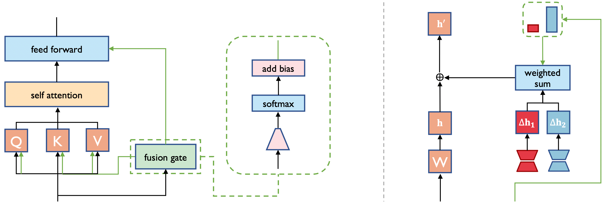

# LoRA-Flow: Dynamic LoRA Fusion for Large Language Models in Generative Tasks

The official repository containing the code, data, and experiment instructions for our ACL 2024 paper. [LoRA-Flow: Dynamic LoRA Fusion for Large Language Models in Generative Tasks](https://aclanthology.org/2024.acl-long.695).

<p align="center">
  <a href="#-news">| 🔥 News</a> |
  <a href="#-lora-flow">🌈 Method</a> |
  <a href="#-experiments">🧪 Experiments |</a> 
</p>

<p align="center">
 | <a href="#-resources">🪵 Resources</a> |
   <a href="#-citation">📓 Citation</a> | 
   <a href="https://aclanthology.org/2024.acl-long.695">📃 Paper |</a>

</p>

# 🔥 News
- Oct 2024: All of our code, data, and checkpoints are open-sourced.
- May 2024: Our paper has been accepted by ACL 2024 main conference.


# 🌈 LoRA-Flow 

To handle generative tasks more flexibly, we propose [**LoRA-Flow**](#LoRA-Flow), which employs dynamic fusion weights at each generation step.

- **Calculating the fusion weights:**

  $$w^l = \text{softmax}(W^l_{\text{gate}} x^l_t) + b^l$$

  Where $l$ is the layer number, $t$ is the time-step number, $x^l_t$ is the Layer-level hidden state at the $t$-th step. $W^l_{\text{gate}} \in \mathbb{R}^{k \times d}$ and $b^l \in \mathbb{R}^{k \times l}$. $k$ is the number of LoRA modules. Both $W^l_{\text{gate}}$ and $b^l$ are learnable parameters.

- **Integrating Fusion Weights:**

  $$h' = h + \Delta h w^l$$

  where $\Delta h = [\Delta h_1; \ldots ; \Delta h_k] \in \mathbb{R}^{d \times k}$ denotes the outputs of all the involved LoRA modules.

- **#Parameters:** LoRA vs gate 117.44M : 0.26M (for Llama2-7B, rank=64.)

<span id="LoRA-Flow"></span>




# 🧪 Experiments

Here are the instructions for training and evaluating a LoRA fusion gate.

## Train
We train LoRA fusion gate based on [BMTrain](https://github.com/OpenBMB/BMTrain) package, which is an efficient large model training toolkit and can train models in a distributed manner while keeping the code as simple as stand-alone training.

### 1. Environment configuration
```
conda create -n loraflow-train python=3.10.13 -y
conda activate loraflow-train
pip install -r requirements.txt
pip uninstall torch torchvision torchaudio -y
pip install torch==1.12.0+cu116 torchvision==0.13.0+cu116 torchaudio==0.12.0 --extra-index-url https://download.pytorch.org/whl/cu116
```
To run experiments on code tasks, you only need to modified *line 141, 156* of `train/ModelCenter/model_center/layer/attention.py` and *line 109, 173, 295* of `train/ModelCenter/model_center/layer/feedforward.py` from `r=64,` to `r=256,` for rank of code lora is 256.

### 2. Model Preparation
Run the following commands to prepare the model, which includes: 1. Downloading the LoRA checkpoints and gates from our [hf repo](https://huggingface.co/Bowen232/LoRA-Flow). 2. Converting the Hugging Face LoRA checkpoints to the BMTrain format. 3. Converting your local Hugging Face LLaMA2-7B checkpoint to the BMTrain format.
```
# Before running the preparation script, obtain access to the Hugging Face repository. 

# Set the Hugging Face token at line 8 and configure the $PATH_TO_LLAMA2_7B_HF variable on line 29 of scripts/model_preparation.sh.

bash scripts/model_preparation.sh
```

### 3. Train
Run the following commands to train a LoRA fusion gate. You can specify the language, task, learning rate, and batch size per device. By default, we train gates using 2 GPUs and 1 gradient accumulation step. If needed, you can make further modifications in the shell later.
```
CUDA_VISIBLE_DEVICES=$GPUS bash scripts/train.sh $language $task $lr $bsz $MASTER_PORT

# For example: 

CUDA_VISIBLE_DEVICES=0,1 bash scripts/train.sh zh math 1e-3 2 12350
```

Since we train the fusion gate with 2 GPUs by default, the best hyperparameters in our paper might seem a bit confusing. Here, we provide a clarified set of hyperparameters, based on tuning with the development set, corresponding to the results reported in our paper.

| Tasks            | Zh Math | Ru Math | Es Math | Zh Code | Ru Code | Es Code |
| ---------------- | ------- | ------- | ------- | ------- | ------- | ------- |
| Total_batch_size | 4       | 4       | 16      | 4       | 16      | 4       |
| Learning_rate    | 1e-3    | 1e-3    | 1e-4    | 1e-3    | 1e-4    | 1e-3    |

Please note that the total batch size is provided here. In our experiments, we train with 2 GPUs, and we recommend using 2 GPUs to reproduce our results. You can adjust `$bsz` in command line and `$FREQ` in `train.sh` according to the memory capacity of your devices.


You can determine the optimal hyperparameters and select the best checkpoint on the development set by using the evaluation code in `UltraEval/eval.sh` and simply changing `test` to `dev` on line 20. See more details about the evaluation in [Evaluation](#evaluation).

## Evaluation
We perform evaluations based on [transformers](https://github.com/huggingface/transformers) and [UltraEval](https://github.com/OpenBMB/UltraEval).


### 1. Environment configuration
```
cd ./UltraEval
conda create -n loraflow-eval python=3.10.13 -y
conda activate loraflow-eval
pip install -r requirements.txt
pip uninstall torch xformers -y
pip install xformers==0.0.23.post1 --index-url https://download.pytorch.org/whl/cu118
pip install torch==2.1.2 --index-url https://download.pytorch.org/whl/cu118
```

### 2. Run evaluation
```
# To make sure you are in ./LoRA-Flow/UltraEval path
cd ./UltraEval

# Configure the $HF_MODEL_NAME variable on line 3 of eval.sh.

bash eval.sh $gpu_id $port $language $task $gate_path 

# For example:

bash eval.sh 0 5008 zh math ../checkpoints/Gates/zh_math.pt 

#You can change the evaluation batch size on line 16 of eval.sh according to the memory capacity of your device.
```

To evaluate on the dev set, simply change `test` to `dev` on line 20 of `UltraEval/eval.sh`.

# 🪵 Resources

## Data
We have released our train, dev, and test datasets for researchers to reproduce our experiments or use in other work. These datasets are already available in this repository, located in the `./data` directory.

## Models
We have released all of our LoRA modules and gates on [Hugging Face](https://huggingface.co/Bowen232/LoRA-Flow).

# 📓 Citation 
```bibtex
@inproceedings{wang-etal-2024-lora-flow,
    title = "LoRA-Flow: Dynamic LoRA Fusion for Large Language Models in Generative Tasks",
    author = "Wang, Hanqing  and
      Ping, Bowen  and
      Wang, Shuo  and
      Han, Xu  and
      Chen, Yun  and
      Liu, Zhiyuan  and
      Sun, Maosong",
    booktitle = "Proceedings of the 62nd Annual Meeting of the Association for Computational Linguistics (Volume 1: Long Papers)",
    month = aug,
    year = "2024",
    address = "Bangkok, Thailand",
    publisher = "Association for Computational Linguistics",
    url = "https://aclanthology.org/2024.acl-long.695",
    doi = "10.18653/v1/2024.acl-long.695",
    pages = "12871--12882",
}
```
